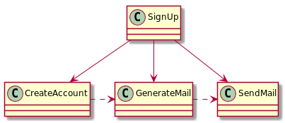

# Working with mocks

my personal heuristics

[github.com/enolive/mock-heuristics](https://github.com/enolive/mock-heuristics)

[@ChristophWelcz](https://twitter.com/ChristophWelcz)

<--->

## Please note

* just my personal opinion out of 4 years of experience with TDD
* just a rule of thumb!
    * I violate them often enough and still think the code is good (enough).

<--->

## Motivation

How many dependencies are in this code?

```java
public void signUp(User user) {
    Account account = createAccountFor(user);
    Mail eMail = generateEMail(account);
    sendEmail(eMail);
}
```

<-->

If you said 3, you are right!


<-->

*framework and technique agnostic*


<--->

## Maximum # of dependencies should be between 2 and 5

* 2~3 great
* up to 5 still okay

What happens if you get more?

<-->

### Violation of SRP

* The SUT is doing too much
* God object

Split it into smaller instances!

<-->


<-->


<-->

### Violation of SLA

* SUT using many dependencies to do one thing combined

Bundle it into a new dependency!

<-->


<--->

## Single Dependency is suspicious

* Dependencies are for collaboration
* How should collaboration work when there is only one dependency?

Why is there only one dependency?

<-->

### Violation of SRP

The dependency is doing too much things

Split it into two dependencies!

<-->


<-->

### Violation of SLA

* Collaborator delegates one thing
* Does other thing by himself

Extract the other thing as well!

<-->


<-->

### Violation of KISS

Dependency is over-engineered

Inline the dependency into the collaborator!

<-->


 

<-->

### Exception

Single dependency for a *Testable Facade*

<-->


<-->


<--->

## # dependencies and LoC inversely proportional

* high number LoC indicates much business logic
* high number of dependencies indicates collaboration

<-->

**never ever** mix business logic and collaboration!

<-->


<-->


<--->

## Ideal # of dependencies is zero

testing with dependencies is hard

extract the code to a separate entity and 
test it directly

<-->

* method
* class

make them public if necessary for testing!

<-->

> Tests trump encapsulation
> -- Uncle Bob
    
<--->

# Thanks!

* [Fake It Outside-In TDD by David Völkel](https://www.slideshare.net/davidvoelkel/fake-it-outsidein-tdd-workshop-clean-code-days)
* [Introduction to Outside-In TDD (and more) by Sandro Mancuso](https://codurance.com/2015/05/12/does-tdd-lead-to-good-design/)
* [Blog article by me about Mock Heuristics](http://www.welcz.de/blog/2016/06/22/my-heuristics-for-working-with-mocks)

